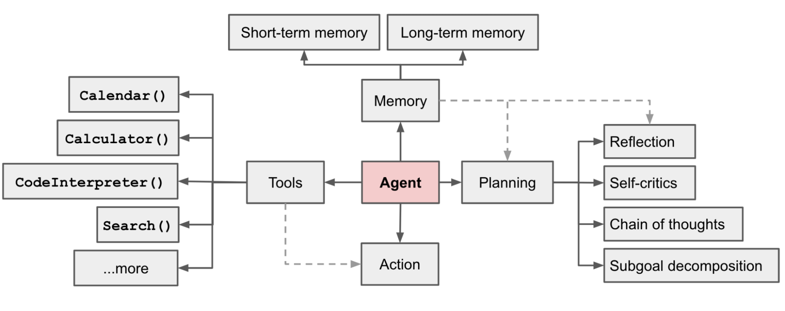
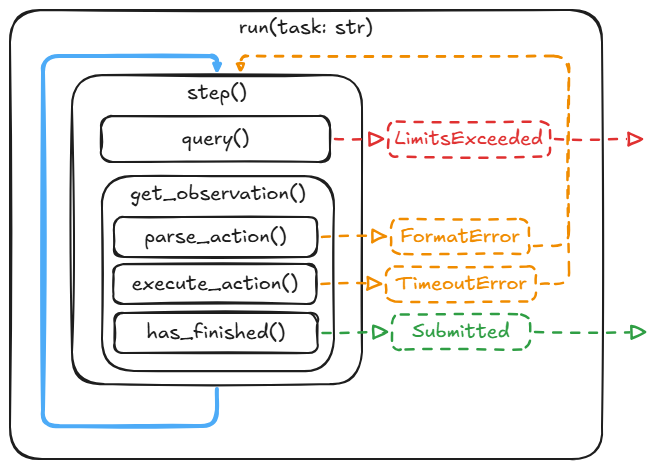

# 从头实现免费的LLM Agent

## 1. 背景简介

在之前的文章中，我们详细介绍了如何[从头实现LLM](https://zhuanlan.zhihu.com/p/8266970536)，这篇文章将介绍如何从头实现一个免费的LLM Agent。LLM就像是一个大脑，而[Agent](https://lilianweng.github.io/posts/2023-06-23-agent/)则是这个大脑的执行器，它能够进行复杂的规划（Planning），记忆管理（Memory），工具调用（Tools），进而自主的完成各种任务。

## 2. mini SWE Agent
本文以[mini-swe-agent](https://github.com/SWE-agent/mini-swe-agent)为基础，介绍如何从头实现一个免费的LLM Agent。mini-swe-agent是一个非常简洁的Agent实现，不依赖LangChain，LangGraph等框架，核心代码不到100行Python，它通过调用命令行来完成各种任务。特别的，它可以解决实际的(Github) Project Issue，且可以达到很好的效果。具体来讲，它的三大模块实现方式是：

- 规划：直接通过Prompt让LLM进行规划

    ```
    ## Recommended Workflow

    This workflows should be done step-by-step so that you can iterate on your changes and any possible problems.

    1. Analyze the codebase by finding and reading relevant files
    2. Create a script to reproduce the issue
    3. Edit the source code to resolve the issue
    4. Verify your fix works by running your script again
    5. Test edge cases to ensure your fix is robust
    6. Submit your changes and finish your work by issuing the following command: `echo COMPLETE_TASK_AND_SUBMIT_FINAL_OUTPUT`.
    ```
- 记忆：直接将所有原始对话历史（包含执行命令行的结果）作为上下文传给LLM，这种简洁的linear history非常方便SFT或者RL的训练。但是其缺点也很明显，就是上下文会越来越长，可能会超出LLM的上下文限制。[Context Engineering](https://blog.langchain.com/context-engineering-for-agents/)是未来的改进方向。
- 工具：唯一的工具就是通过`subprocess.run`调用命令行。每次执行一条命令。
    ```
    <response_example>
    Here are some thoughts about why you want to perform the action.

    ``bash
    your_command_here
    ``
    </response_example>
    ```
其源代码在src/minisweagent下，agents是Agent的核心逻辑，config是配置文件和Prompt（其中mini.yaml是本文实际采用的Prompt，这个文件定义了agent的运作方式），environments是执行环境（本地subprocess.run或者docker），models是调用LLM的接口，run是运行入口。其中，核心逻辑用下图表示：



- run(task): 运行入口，task是用户输入的任务
- step(): Agent的每一步，循环执行直到任务完成，它包含query()和get_observation()两个子模块
- query(): 调用LLM，传入当前的对话历史，得到LLM的回复并加入历史`self.add_message("assistant", response)`
- get_observation(): 解析LLM的回复，提取（parse_action）出要执行的命令行并执行(execute_action)，将结果加入user utterance: `self.add_message("user", observation)`，并判断任务是否完成(has_finished)
## 3. 调用免费的LLM
目前，大量的LLM都有一定的免费额度，且兼容OpenAI接口，比如Google Gemini的示例代码调用为：
```python
from openai import OpenAI

client = OpenAI(
    api_key="YOUR_GEMINI_API_KEY",
    base_url="https://generativelanguage.googleapis.com/v1beta/openai/"
)

response = client.chat.completions.create(
    model="gemini-2.5-flash",
    messages=[
        {"role": "system", "content": "You are a helpful assistant."},
        {
            "role": "user",
            "content": "Explain to me how AI works"
        }
    ]
)

print(response.choices[0].message)
```
本文的代码在：https://github.com/schinger/Mini-Agent
，将上述的示例代码包装成GoogleModel类，放在src/minisweagent/models/google_model.py中。你也可以将google LLM替换成其他免费的LLM。
## 4. 安装运行
```bash
git clone https://github.com/schinger/Mini-Agent
cd mini-swe-agent
pip install -e .
export MSWEA_MODEL_API_KEY="YOUR_GEMINI_API_KEY"
# cd to any directory you want, and run:
mini
```

你可以尝试让Agent完成各种任务，比如：
- Implement a Sudoku solver in python in the sudoku folder. Make sure the codebase is modular and well tested with pytest.
- Please run pytest on the current project, discover failing unittests and help me fix them. Always make sure to test the final solution.
- Help me document & type my codebase by adding short docstrings and type hints.

也可以通过修改`mini.yaml`来定制Agent的行为。

## 5. Agent的未来
- End2end Agent Training: 目前LLM的训练已经非常成熟，其能力也越来越强大（已经可以斩获IMO，IOI金牌），但是将其整合成长程LLM Agent时，却面临诸多挑战，例如错误的累积，常识的缺乏，长程训练的困难等等，端到端训练LLM Agent是未来的一个重要方向。
- Multi Agent： 多Agent协同工作，模拟人类社会的分工与合作，其能力将远超单一Agent。
- Science Discovery Agent：可以是数学，物理，化学，计算机等领域的科学家Agent，能够自主发现新的定理，定律，材料，技术等。
- Robot: 机器人就是一个物理世界的Agent。
- Godel Agent：随着LLM代码能力越来越强大，Agent可以自己编写/修改自己的代码，形成一个自我指涉、自我进化的[Godel Agent](https://arxiv.org/abs/2505.22954)。事实上，本文所介绍的Agent就可以是Godel Agent，因为它可以修改自己当前目录下的代码。
- LLM Developer Agent：作为Agent核心的LLM，其开发，改进，训练，评测目前仍由人类合作完成，以后可以让Agent自己来完成这些工作，形成LLM和Agent不断提升的闭环。

简言之，[人工智能的递归自我提升已经到来](https://zhuanlan.zhihu.com/p/1932147871320379907)。